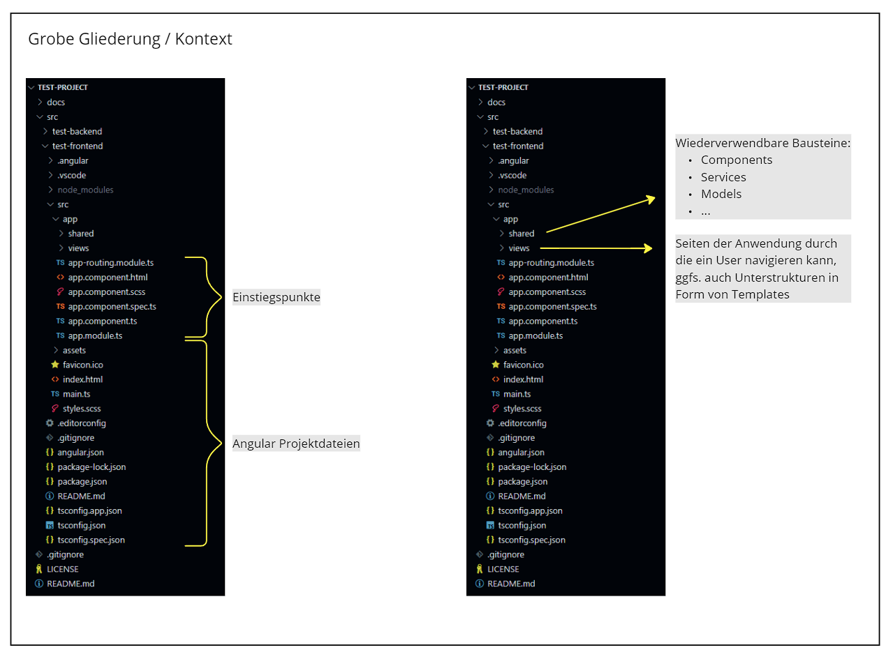
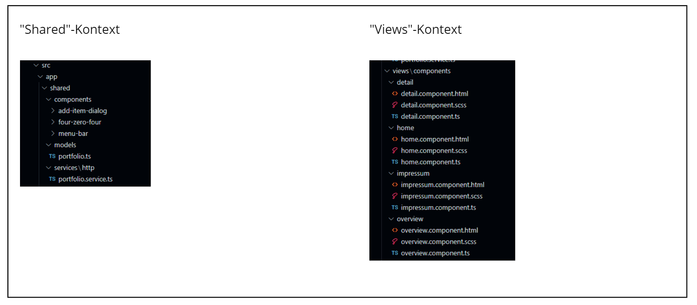
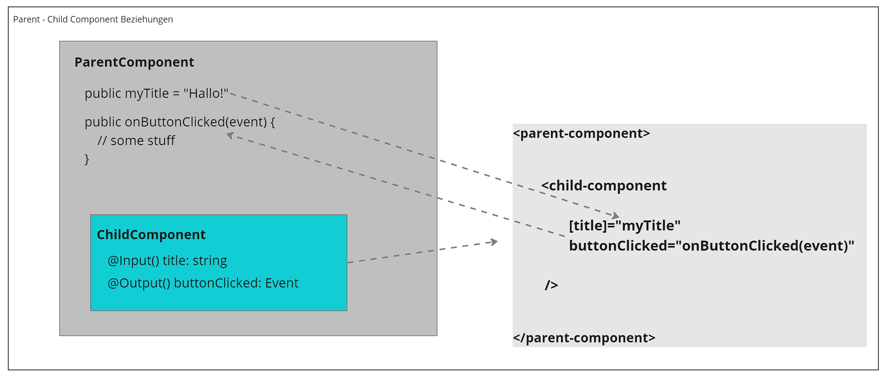
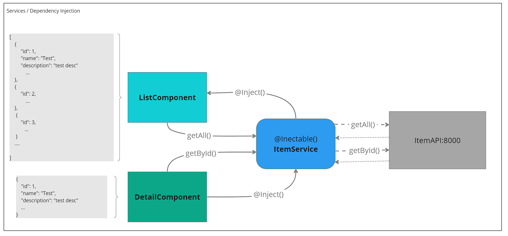

# Angular basic structure (architecture principles)

Here are some sample graphics to help understanding basic structures of the angular framework.
They are not complete but tried to represents concepts as easy as possible.

# Files and folder structures

# Parent and child component communication

# Service injection into component

